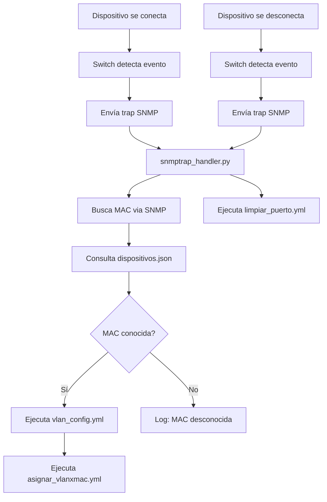

# 📚 Índice de Documentación - Sistema Ansible TDGRedes

## 📋 Documentos Disponibles

### 📖 [DOCUMENTACION_COMPLETA.md](./DOCUMENTACION_COMPLETA.md)
**Documentación técnica completa del sistema**
- Estructura detallada del proyecto
- Función de cada archivo y script
- Variables y configuraciones
- Flujo de trabajo automatizado
- Características de simultaneidad

### 🚀 [GUIA_USO_PRACTICA.md](./GUIA_USO_PRACTICA.md)
**Guía práctica con ejemplos de uso**
- Ejemplos paso a paso
- Escenarios de conexión/desconexión
- Pruebas y testing
- Configuraciones avanzadas
- Resolución de problemas

### 🔧 [access_control/README_CONCURRENCIA.md](./access_control/README_CONCURRENCIA.md)
**Mejoras de simultaneidad implementadas**
- Funcionalidades concurrentes
- Comandos de monitoreo
- Beneficios de rendimiento
- Características de robustez

---

## 🎯 Inicio Rápido

### 1. **Revisar la documentación completa**
```bash
# Leer estructura y funcionamiento
cat DOCUMENTACION_COMPLETA.md
```

### 2. **Seguir la guía práctica**
```bash
# Ejemplos de uso paso a paso
cat GUIA_USO_PRACTICA.md
```

### 3. **Entender las mejoras de concurrencia**
```bash
# Características avanzadas del sistema
cat access_control/README_CONCURRENCIA.md
```

---

## 🏗️ Arquitectura del Sistema

```
┌─────────────────────────────────────────────────────────────┐
│                    SISTEMA TDGRedes                        │
├─────────────────────────────────────────────────────────────┤
│                                                             │
│  🌐 Red IPv6 con VLANs Dinámicas                          │
│  ├── Router Cisco (DHCPv6 Server)                         │
│  └── Switch Cisco (VLAN + Port Security)                  │
│                                                             │
│  🤖 Automatización Ansible                                │
│  ├── Playbooks para configuración                         │
│  ├── Roles reutilizables                                  │
│  └── Inventario y variables                               │
│                                                             │
│  📡 Sistema SNMP Concurrente                              │
│  ├── Detección automática de eventos                      │
│  ├── Cache inteligente con TTL                            │
│  ├── Procesamiento concurrente                            │
│  └── Monitoreo en tiempo real                             │
│                                                             │
└─────────────────────────────────────────────────────────────┘
```

---

## 📊 Flujo de Trabajo Principal



---

## 🛠️ Herramientas Principales

| Herramienta | Archivo | Función |
|-------------|---------|---------|
| **Monitor SNMP** | `access_control/snmp_monitor.py` | Monitoreo y estadísticas del sistema |
| **Handler SNMP** | `access_control/snmptrap_handler.py` | Procesamiento automático de traps |
| **Configurador VLAN** | `playbooks/vlan_config.yml` | Configuración dinámica de VLANs |
| **Control MAC** | `playbooks/asignar_vlanxmac.yml` | Port-security por MAC |
| **Limpieza** | `playbooks/limpiar_puerto.yml` | Limpieza de puertos |

---

## 🎮 Comandos Esenciales

### Monitoreo del sistema
```bash
cd access_control/
./snmp_monitor.py stats                    # Ver estadísticas
./snmp_monitor.py monitor                  # Monitoreo en tiempo real
./snmp_monitor.py logs --lines 50          # Ver logs recientes
```

### Configuración manual
```bash
# Configurar DHCPv6 en router
ansible-playbook -i inventory/inventory.yml playbooks/dhcp6_config.yml

# Configurar VLAN específica
export VLAN_ID=20
ansible-playbook -i inventory/inventory.yml playbooks/vlan_config.yml

# Asignar puerto por MAC
export MAC_ADDRESS="30:13:8B:F1:00:BE"
export VLAN_ID=20
export PUERTO="FastEthernet0/1"
ansible-playbook -i inventory/inventory.yml playbooks/asignar_vlanxmac.yml
```

### Testing y pruebas
```bash
# Pruebas de switch
ansible-playbook -i ../inventory/inventory.yml playbooks/switchtest.yml

# Pruebas de router
ansible-playbook -i ../inventory/inventory.yml playbooks/routertest.yml

# Simulación de carga
./snmp_monitor.py test-concurrent --requests 5
```

---

## 📞 Información de Contacto

**Proyecto**: TDGRedes - Automatización de Redes IPv6
**Autor**: Sistema automatizado con Ansible y Python
**Fecha**: Julio 2025
**Versión**: 2.0 (con soporte de simultaneidad)

---

## 🔗 Enlaces Rápidos

- **[Configuración inicial →](./GUIA_USO_PRACTICA.md#-configuración-inicial)**
- **[Escenarios de uso →](./GUIA_USO_PRACTICA.md#-escenarios-de-conexión-de-dispositivos)**
- **[Resolución de problemas →](./GUIA_USO_PRACTICA.md#-resolución-de-problemas)**
- **[Arquitectura técnica →](./DOCUMENTACION_COMPLETA.md#-estructura-del-proyecto)**
- **[Mejoras de concurrencia →](./access_control/README_CONCURRENCIA.md#-funcionalidades-implementadas)**

---

*Este sistema proporciona automatización completa del control de acceso de red con soporte total para simultaneidad y monitoreo en tiempo real.*
